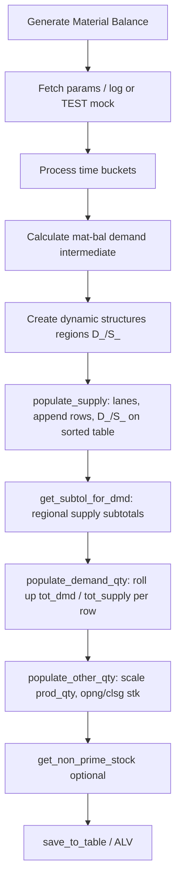
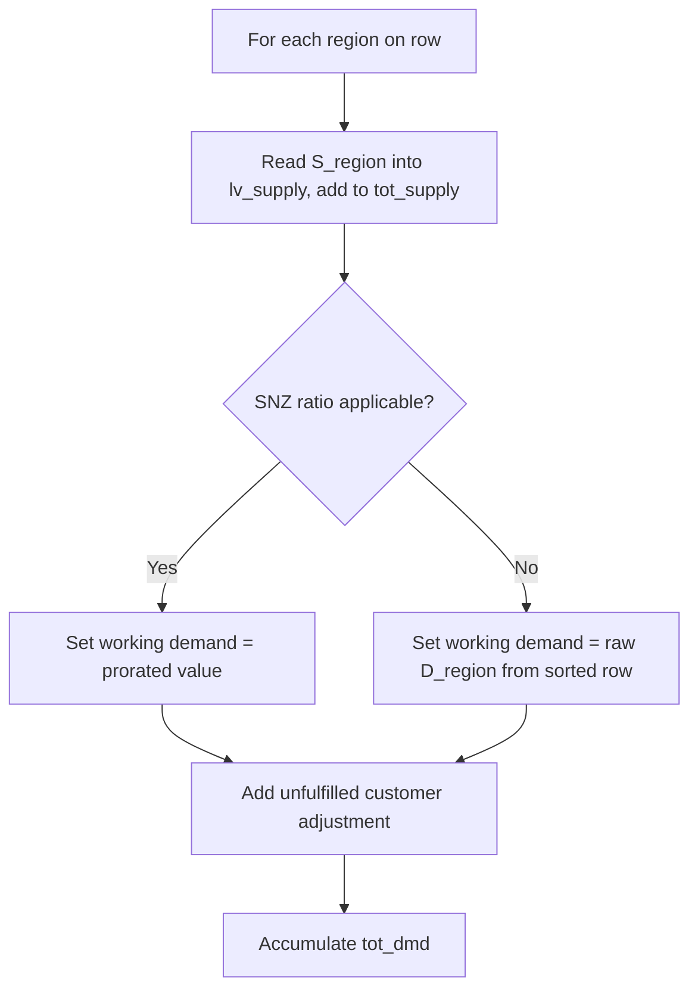
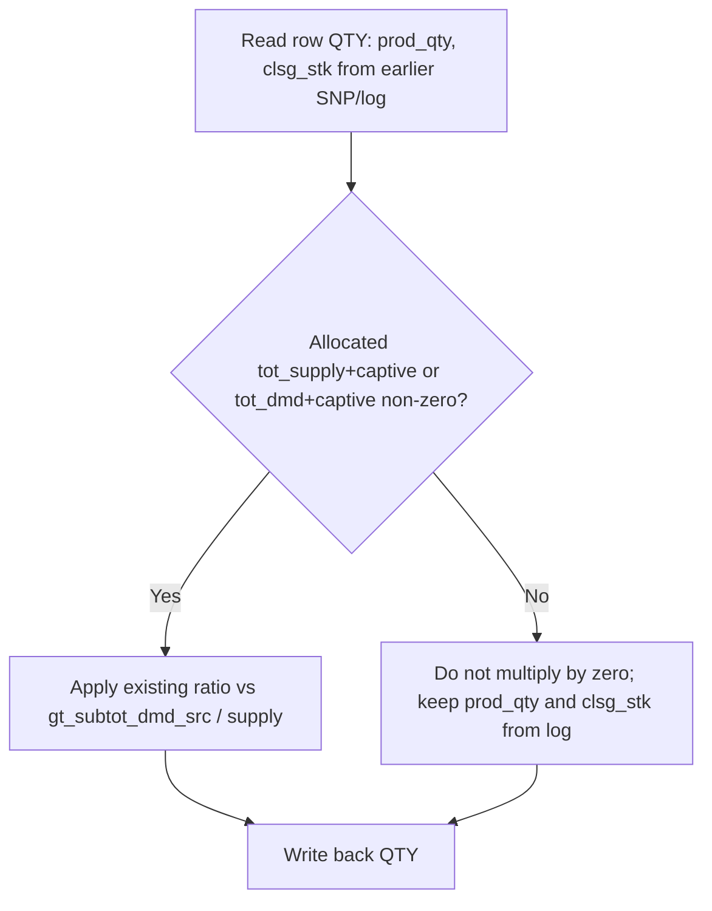

# Material Balance Report — Zero Quantities Analysis (FS / TS / Code Change)

**Program / include:** `ZAPO_MATERIAL_BALANCE` → include `ZAPO_MATERIAL_BALANCE_CLS` → class `lcl_material_balance`  
**Test context (as stated):** Optimizer run `P1004445:001:2026.04.16-16:30:29`, Division `14`, output `Output_Matbal.xls`  
**Note:** `Test_WIP_Matbal.xlsx` was not present in the workspace at analysis time; assumptions follow the standard selection-screen parameters (session / division / material ranges).

---

## 1. Symptom

In `Output_Matbal.xls`, these columns are **zero** for affected rows:

- Total Demand  
- Production quantity  
- Total Supply  
- Closing Stock  

Other columns (e.g. descriptions, plants, calendar month) may still populate from master / log data.

---

## 2. Functional flow of the solution

### 2.1 End-to-end program flow (high level)



**Functional intent**

- **`populate_supply`:** Builds the lane picture: which source → supply plant → material → month gets how much regional **supply** and customer **demand** on dynamic **`S_<region>`** / **`D_<region>`** fields.
- **`get_subtol_for_dmd`:** Builds **`gt_subtot_reg_loc`** so demand can be **prorated** when demand is “fully supplied” (SNZ path) using regional supply weights.
- **`populate_demand_qty`:** Walks each sorted row and each region; copies regional **`S_*`** into **`tot_supply`**; uses SNZ/S subtotals + **`lv_supply`** to compute scaled regional demand into the output row, then adds **unfulfilled** demand; writes **`tot_dmd`** / **`tot_supply`** on the **`QTY`** structure.
- **`populate_other_qty`:** **Re-prorates** production and closing stock so they stay consistent with the row’s allocated totals vs plant/month subtotals.

### 2.2 Where it broke (functional view)

| Step | Intended behaviour | What went wrong |
|------|--------------------|-----------------|
| **`populate_demand_qty`** | Every region with demand on the row should contribute to **Total demand**; if SNZ ratio applies, use prorated amount; otherwise use **raw regional `D_*`**. | If SNZ branch did not run (**no regional supply `S_*`** or missing subtotal reads), **raw `D_*` was never applied** → **`tot_dmd` stayed 0**. **`tot_supply`** only sums **`S_*`**; if those were 0, **Total supply** stayed 0. |
| **`populate_other_qty`** | Scale **production** and **closing stock** only when there is a **non-zero allocation basis** (allocated supply/demand on the row). | Code used branches where the denominator was non-zero but the **numerator `(tot_supply + captive)` was 0** → **production and closing stock forced to 0** even when SNP had already filled them. |

So functionally: **the demand step dropped numbers**, then **the scaling step zeroed physical quantities** that should have been left alone.

### 2.3 Functional flow after the solution

**Correction A — `populate_demand_qty` (demand path)**



**Functional rule:** *If we can prorate using SNZ/S, use the ratio; **otherwise still carry the raw regional demand** into the row before unfulfilled logic.*

That restores **Total demand** (and leaves **Total supply** as the sum of **`S_*`**, unchanged by this fix).

**Correction B — `populate_other_qty` (production & closing stock)**



**Functional rule:** *Proration is only applied when there is a **meaningful numerator**; if allocated totals are still zero, **do not wipe** production or closing stock.*

**Correction C — `append_to_outtab_dyn` (existing row)**

**Functional rule:** *When merging into an **existing** key, update the **customer** sub-table only if the **CUSTOMER** component actually exists — guard with **`<lfs_comp_tab>`**, not the STRUCT field symbol.*

### 2.4 One-line summary

**Before:** Demand totals ignored raw `D_*` when SNZ did not run; then scaling treated “zero allocated flow” as “zero everything”, including SNP production and stock.

**After:** Always carry regional demand when ratio does not apply; only scale production and closing stock when allocation totals justify it; fix the customer merge guard.

---

## 3. Root cause (technical)

### 3.1 Primary defect — `populate_demand_qty`

**Location:** method `populate_demand_qty`, region loop over `gt_reg_off_desc`, demand branch for dynamic component `D_<reg_off>`.

**What the code does today**

1. For each region, it assigns `lv_supply` from the corresponding `S_<reg_off>` component on the sorted row (`<lfs_fin_sort>`).  
2. It assigns `<lfs_comp2>` to the `D_<reg_off>` field on the output structure **without** first copying the raw demand `<lfs_comp>` from `<lfs_fin_sort>`.  
3. It only replaces `<lfs_comp2>` when **all** of the following hold:

   - `READ TABLE gt_subtot_reg_loc` with `indicator = 'SNZ'` succeeds, **and**  
   - `lv_supply IS NOT INITIAL`, **and**  
   - `READ TABLE` with `indicator = 'S'` succeeds, **and**  
   - `<lfs_subtotal_s>-supply_sum` is not initial.

4. It then adds unfulfilled demand: `<lfs_comp2> = <lfs_comp2> + lv_unfulfilled_dmd`.  
5. It accumulates `ls_fin_qty-tot_dmd` from `<lfs_comp2>`.

**Bug:** If the SNZ ratio block is **not** executed (typical when **regional supply `S_*` is zero** for that region/month, or SNZ/S subtotal rows are missing), `<lfs_comp2>` stays **initial**. The **raw regional demand** `<lfs_comp>` is **never** added into `<lfs_comp2>` before step 4. Unless unfulfilled logic alone fills quantity, **`tot_dmd` stays zero** even when `D_*` on the sorted table has non-zero demand.

**Effect on Total Supply:** In the same loop, `tot_supply` is summed from `S_*` only. If lanes did not push regional supply into `S_*` (or all zeros), **`tot_supply` is also zero**. Together, this matches “Total Demand” and “Total Supply” both zero in the persisted output.

**Reference (existing code):**

```5490:5583:WIP2 Substitution/Matbal/ZAPO_MATERIAL_BALANCE_CLS.txt
          lv_fieldname = 'D_' && <lfs_reg_off>-reg_off.
          UNASSIGN <lfs_comp>.
          ASSIGN COMPONENT lv_fieldname OF STRUCTURE <lfs_fin_sort> TO <lfs_comp>.
          IF <lfs_comp> IS ASSIGNED.
            UNASSIGN <lfs_comp2>.
            ASSIGN COMPONENT lv_fieldname OF STRUCTURE <lfs_outtab_struct> TO <lfs_comp2>.
            IF <lfs_comp2> IS ASSIGNED.
              UNASSIGN <lfs_subtotal>.
              READ TABLE gt_subtot_reg_loc ASSIGNING <lfs_subtotal>
                WITH TABLE KEY
                  supply_loc = space
                  matnr = ls_fin_fields-matnr
                  region = <lfs_reg_off>-reg_off
                  month = ls_fin_fields-cal_mth
                  indicator = 'SNZ'.
              IF sy-subrc = 0 AND <lfs_subtotal> IS ASSIGNED AND lv_supply IS NOT INITIAL.
                ...
                  <lfs_comp2> = <lfs_subtotal>-supply_sum * lv_supply / <lfs_subtotal_s>-supply_sum.
                ENDIF.
              ENDIF.
              ...
              <lfs_comp2> = <lfs_comp2> + lv_unfulfilled_dmd.
              ls_fin_qty-tot_dmd = ls_fin_qty-tot_dmd + <lfs_comp2>.
```

There is **no** assignment `<lfs_comp2> = <lfs_comp>` when the SNZ branch is skipped.

---

### 3.2 Secondary defect — `populate_other_qty` (amplifies zeros)

**Location:** method `populate_other_qty`, after `populate_demand_qty` has written `ls_fin_qty-tot_supply`, `ls_fin_qty-tot_dmd`, etc.

**What the code does**

- Scales **`prod_qty`** using `(tot_supply + captive_supply) / gt_subtot_dmd_src-supply_sum` when `supply_sum` is not initial.  
- Scales **`clsg_stk`** using the same numerator against `gt_subtot_dmd_supply-supply_sum`.

**Bug:** When `tot_supply` and `captive_supply` are **both initial** (because of **3.1** or because no supply was allocated to the row), the expression becomes:

`prod_qty * 0 / supply_sum  =>  0`

and similarly for **`clsg_stk`**. So **physical production and closing stock read from SNP tables in earlier steps are wiped to zero** even when `gt_prod_qty` / `gt_snpopmlo` had populated non-zero values on the row before scaling.

**Reference (existing code):**

```5775:5808:WIP2 Substitution/Matbal/ZAPO_MATERIAL_BALANCE_CLS.txt
      IF sy-subrc = 0 AND <lfs_subtotal> IS ASSIGNED.
        IF <lfs_subtotal>-supply_sum IS NOT INITIAL.
          ls_fin_qty-prod_qty = ls_fin_qty-prod_qty * ( ( ls_fin_qty-tot_supply + ls_fin_qty-captive_supply ) / <lfs_subtotal>-supply_sum ).
        ELSEIF <lfs_subtotal>-dmd_sum IS NOT INITIAL.
          ls_fin_qty-prod_qty = ls_fin_qty-prod_qty * ( ( ls_fin_qty-tot_dmd + ls_fin_qty-captive_dmd ) / <lfs_subtotal>-dmd_sum ).
        ...
      ENDIF.
...
        IF <lfs_subtotal>-supply_sum IS NOT INITIAL.
          ls_fin_qty-clsg_stk = ls_fin_qty-clsg_stk * ( ls_fin_qty-tot_supply + ls_fin_qty-captive_supply ) / <lfs_subtotal>-supply_sum.
        ELSEIF <lfs_subtotal>-dmd_sum IS NOT INITIAL.
          ls_fin_qty-clsg_stk = ls_fin_qty-clsg_stk * ( ls_fin_qty-tot_dmd + ls_fin_qty-captive_dmd ) / <lfs_subtotal>-dmd_sum.
```

Comments at 5811–5812 acknowledge historical issues with opening/closing when demand/supply are zero, but **production** is still zeroed by the branch at 5776–5777 when the numerator is zero.

---

### 3.3 Additional code smell — `append_to_outtab_dyn` (existing row)

**Location:** `append_to_outtab_dyn`, after `READ TABLE <lfs_table>` finds an existing key.

After assigning the `CUSTOMER` component to `<lfs_comp_tab>`, the code checks **`IF <lfs_comp> IS ASSIGNED.`** (STRUCT field) instead of **`IF <lfs_comp_tab> IS ASSIGNED.`** This is misleading and fragile if the structure layout changes. It should guard the customer table with `<lfs_comp_tab>`.

**Reference:**

```5984:6010:WIP2 Substitution/Matbal/ZAPO_MATERIAL_BALANCE_CLS.txt
      UNASSIGN <lfs_comp_tab>.
      ASSIGN COMPONENT 'CUSTOMER' OF STRUCTURE <lfs_final> TO <lfs_comp_tab>.
      IF <lfs_comp> IS ASSIGNED.
        READ TABLE <lfs_comp_tab> TRANSPORTING NO FIELDS
```

---

### 3.4 Optional check — `get_subtol_for_dmd`

`lv_locno` is `CLEAR`ed and never assigned before `READ/INSERT` on `gt_subtot_reg_loc` uses `supply_loc = lv_locno` (always initial). That matches `populate_demand_qty` reads that use `supply_loc = space` for indicators `SNZ` / `S`, but **`do_subtol_for_dmd`** for indicator **`SZ`** uses real `iv_locfrm` — a design inconsistency that can affect ratio edge cases. Not required to explain “all four columns zero” if **3.1 + 3.2** apply; worth a separate review with business owners.

---

## 4. Functional Specification (FS)

### 4.1 Background

The Material Balance report aggregates SNP optimizer log data by source plant, supply plant, material, and calendar month. It must show:

- Total demand and total supply consistent with regional `D_*` / `S_*` columns where applicable.  
- Production quantity from planned production (`gt_prod_qty` / process order data in the log pipeline).  
- Closing stock from locational material (`gt_snpopmlo`) after time-phasing.

### 4.2 Problem

For optimizer session **P1004445:001:2026.04.16-16:30:29** (Division **14**), saved output shows **zero** total demand, total supply, production quantity, and closing stock for rows where SNP and log tables still contain movements and stock.

### 4.3 Required behaviour

1. **Total demand (`tot_dmd`)**  
   - Must reflect regional demands on the sorted supply row.  
   - When the SNZ proration subtotals are **not** applicable (e.g. no regional supply for that region in that month, or missing SNZ row), **total demand shall still include the raw `D_<region>` quantity** from the sorted row, plus any unfulfilled customer adjustment already implemented.

2. **Total supply (`tot_supply`)**  
   - Shall continue to be the sum of `S_<region>` values as today. (If upstream `populate_supply` leaves all `S_*` zero, totals can remain zero; that is a data/lane issue, not the same defect as demand.)

3. **Production quantity (`prod_qty`)**  
   - Shall **not** be forced to zero solely because allocated total supply/demand on the row is zero. Physical production from the log must be preserved unless a **documented** business rule explicitly requires proration to zero.

4. **Closing stock (`clsg_stk`)**  
   - Same as production: **do not multiply down to zero** when the proration numerator (`tot_supply + captive_supply` or `tot_dmd + captive_dmd`) is initial; retain SNP-derived closing stock unless a defined proration applies with non-zero numerator.

### 4.4 Acceptance criteria

- Re-run generate with the same session and division: rows that previously showed non-zero `D_*` in the internal sorted table must show **non-zero Total Demand** in `Output_Matbal.xls` when unfulfilled add-on is zero.  
- Rows with non-zero production in `gt_prod_qty` for the row key must show **non-zero Production quantity** after generate, unless material master unit conversion explicitly divides to negligible values.  
- Rows with non-zero `gt_snpopmlo`-stock for the bucket must not show **Closing Stock = 0** only because `tot_supply` was zero after demand step.  
- Regression: scenarios where SNZ ratio **is** valid must still prorate `D_*` as today.

---

## 5. Technical Specification (TS)

| Item | Detail |
|------|--------|
| Object | Include `ZAPO_MATERIAL_BALANCE_CLS`, methods `populate_demand_qty`, `populate_other_qty`, optionally `append_to_outtab_dyn` |
| Trigger | `generate_material_balance` → … → `populate_demand_qty` → `populate_other_qty` → `append_for_db_upd` / save |
| Data structures | Dynamic row: components `STRUCT`, `QTY`, `D_<reg>`, `S_<reg>`, nested `CUSTOMER`; `gty_fin_qty`; tables `gt_subtot_reg_loc`, `gt_subtot_dmd_src`, `gt_subtot_dmd_supply` |
| Change 1 | In `populate_demand_qty`, after SNZ/S ratio logic, if ratio was not applied, set output `D_<reg>` / working field to **raw** `<lfs_comp>` before unfulfilled add |
| Change 2 | In `populate_other_qty`, apply `prod_qty` and `clsg_stk` scaling **only if** the chosen numerator (`tot_supply+captive` or `tot_dmd+captive`) is **not initial**; otherwise leave quantities unchanged for that branch |
| Change 3 | In `append_to_outtab_dyn`, replace `IF <lfs_comp> IS ASSIGNED` with `IF <lfs_comp_tab> IS ASSIGNED` after assigning `CUSTOMER` |
| Transport | Single TR with unit tests on Division 14 session above + one regression session with full SNZ proration |

---

## 6. Code changes (ABAP) — apply in SAP editor

Copy-paste–ready snippets and step-by-step edits are in **`ZAPO_MATERIAL_BALANCE_Code_Corrections_Only.md`**. Summary:

### 6.1 `populate_demand_qty`

After the existing SNZ / `S` ratio logic for `D_<reg>`, if the ratio was **not** applied, assign `<lfs_comp2> = <lfs_comp>` before the unfulfilled loop so raw regional demand flows into `tot_dmd`. Use a boolean flag (e.g. `lv_dmd_ratio_used`) set to `abap_true` only when the ratio assignment runs.

### 6.2 `populate_other_qty`

Before scaling `prod_qty` and `clsg_stk`, require the corresponding numerator (`tot_supply + captive_supply` or `tot_dmd + captive_dmd`) to be **not initial** so log-based quantities are not multiplied down to zero.

### 6.3 `append_to_outtab_dyn`

Replace `IF <lfs_comp> IS ASSIGNED.` with `IF <lfs_comp_tab> IS ASSIGNED.` after assigning the `CUSTOMER` component:

```abap
ASSIGN COMPONENT 'CUSTOMER' OF STRUCTURE <lfs_final> TO <lfs_comp_tab>.
IF <lfs_comp_tab> IS ASSIGNED.
```

---

## 7. Verification steps

1. SE38 / SA38: run material balance generation with session `P1004445:001:2026.04.16-16:30:29`, Division `14`, same material selection as `Test_WIP_Matbal.xlsx` (attach file to ticket for auditors).  
2. Compare ALV / `Output_Matbal.xls` before vs after: **Total Demand**, **Production quantity**, **Total Supply**, **Closing Stock**.  
3. Run a second session where SNZ proration is known to apply; confirm **no change** in prorated demand vs baseline (regression).

---

## 8. File inventory (this folder)

| File | Purpose |
|------|---------|
| `ZAPO_MATERIAL_BALANCE_CLS.txt` | Exported include source reviewed |
| `Output_Matbal.xls` | Output referenced by user |
| `Matbal_Zero_Qty_Analysis_FS_TS_CodeChange.md` | This document (symptom, functional flow, root cause, FS, TS, code summary, verification, summary) |
| `ZAPO_MATERIAL_BALANCE_Code_Corrections_Only.md` | ABAP corrections only (for transport / peer review) |

**Missing from workspace:** `Test_WIP_Matbal.xlsx` — add under `Matbal\` when available for traceability.

---

## 9. Summary

| Column | Why it was zero |
|--------|------------------|
| **Total Demand** | `populate_demand_qty` never moved raw `D_*` into the working field when SNZ ratio was skipped (`lv_supply` initial or SNZ/S read failed). |
| **Total Supply** | Often zero together when no `S_*` on row; primary user-visible demand issue is **3.1**. |
| **Production quantity** | `populate_other_qty` multiplied `prod_qty` by **zero** numerator after **3.1**. |
| **Closing Stock** | Same scaling issue for `clsg_stk` with zero numerator. |

**Primary code fix:** demand fallback in `populate_demand_qty`.  
**Mandatory companion fix:** conditional scaling in `populate_other_qty` so physical quantities are not destroyed when totals are still initial.

---

*Document generated from static analysis of `ZAPO_MATERIAL_BALANCE_CLS.txt` in the Cursor workspace.*
